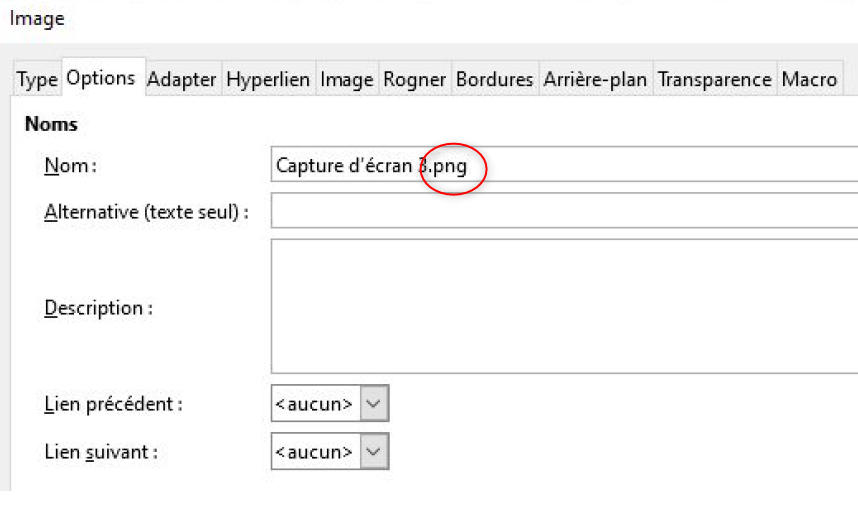
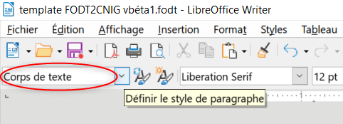
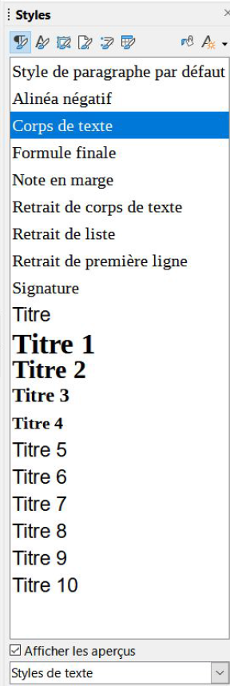
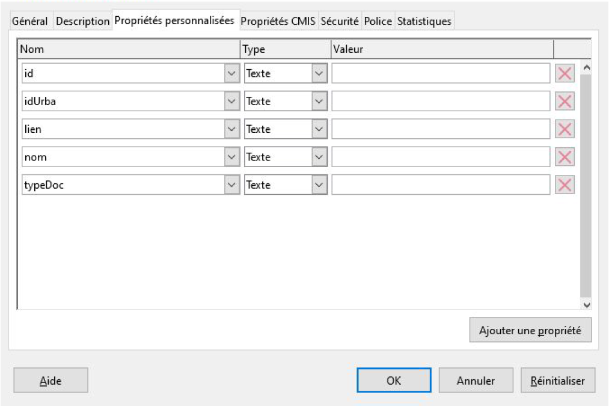
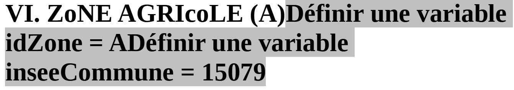
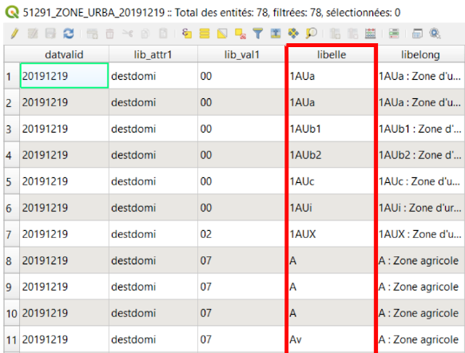
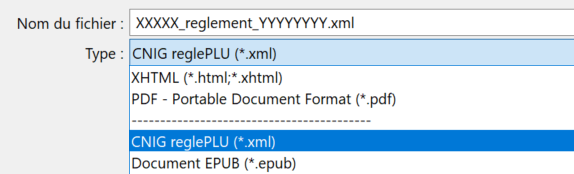
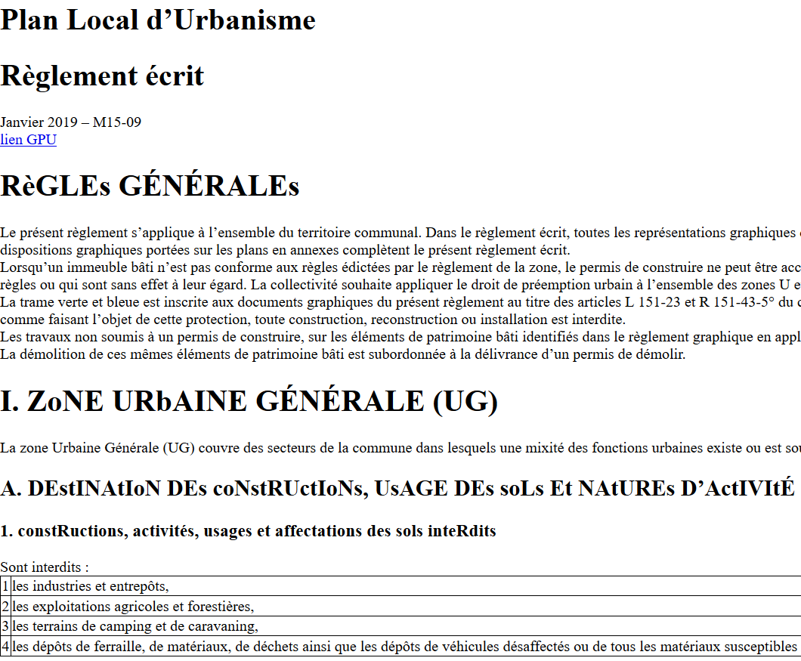

= Manuel opérateur pour la numérisation du règlement
d’urbanisme

Version du 04/03/2021

== Sommaire
 * <<Introduction>>
 * <<Etape 1. Installer les pré-requis>>
 * <<Etape 2. Copie du PLU original>>
 * <<Etape 3. Mise en page>>
 * <<Etape 4. Renseigner les métadonnées du règlement écrit>>
 * <<Etape 5. Ajouter les champs personnalisés>>
  ** <<Etape 5.1 Identification des champs dans les titres>>
  ** <<Etape 5.2 Identification des champs dans les paragraphes (zones et prescriptions)>>
 * <<Etape 6. Export au format CNIG>>
 * <<Etape 7. Vérification>>

:toc:

== Introduction

=== Contexte

Le http://cnig.gouv.fr/[CNIG] développe actuellement un format de structuration des règlements d'urbanisme afin de les rendre plus facilement exploitables par des machines.
L'objectif à long terme de ce standard est de développer des applications pour faciliter l'instruction des demandes de permis de construire par exemple.

Afin de faciliter la transformation d'un PLU dans ce nouveau format, un outil a été créé à partir de LibreOffice. Il s'agit d'un premier outil simple pour traiter les PLU existants au format PDF.

=== Objectif

Ce manuel opérateur est destiné aux collectivités territoriales et leurs prestataires pour effectuer la numérisation de leur PLU sous LibreOffice. Il vous donnera toutes les étapes nécessaires à cette numérisation.
L’objectif de la numérisation du PLU est de créer un règlement interactif et exploitable informatiquement (au contraire d’un document au format PDF qui est figé et inexploitable informatiquement). Grâce à cette numérisation, divers projets peuvent être mis en place, notamment l’accès aux règles d’urbanisme applicables à une parcelle en lien avec le Géoportail de l’Urbanisme. D’autres applications peuvent exploiter ces données informatisées dans le but de modéliser les contraintes d’urbanisme.
La numérisation du règlement d’urbanisme repose uniquement sur des logiciels libres.

=== Exemple

Vous trouverez https://github.com/cnigfr/structuration-reglement-urbanisme/blob/master/outils/Filtre_LibreOffice/exemple%20PLU_Jaleyrac.odt[ici] un exemple de PLU réalisé sous LibreOffice.

== Définitions et acronymes

*Champ* : Un champ dans LibreOffice est une fonction qui permet d’ajouter du contenu dynamique au règlement écrit à structurer. Nous utilisons les champs dans LibreOffice Writer pour définir les différentes zones et prescriptions auxquelles s’applique une partie du règlement.

*CNIG* : Conseil National de l'Information Géographique

*GPU* : Géoportail de l'Urbanisme

*Métadonnée* : Il s'agit dans LibreOffice d'informations renseignées au niveau des propriétés du document. Par la suite, elles sont utilisées pour fournir des attributs d'identification dans le format CNIG. Ces inforomations sont utilisées par la suite pour pour le catalogage des différents documents présents sur le Géoportail de l'Urbanisme.

*OCR* : optical caracter recognition. Outil de reconnaissance de texte.

*PLU* : Plan Local d’Urbanisme.
Ici, nous ne traitons que le texte réglementaire du PLU (pièce Règlement écrit dans le GPU).

*PLUi* : PLU intercommunal. De même que pour le PLU, nous ne transformons que la pièce Règlement écrit.

*Prescription* : Une prescription se présente dans le standard CNIG PLU sous la forme d'une information surfacique, linéaire ou ponctuelle qui apparaît sur les documents graphiques du PLU. Une prescription qui se superpose à une zone du document d'urbanisme exerce en général une contrainte supplémentaire au règlement de la zone.
Les prescriptions sont des couches géographiques matérialisées par les tables PRESCRIPTION_xxx dans le GPU.

*Style* : Les styles de LibreOffice Writer définissent les caractéristiques de mise en forme des éléments qui composent le document LibreOffice. Ils sont utilisés lors de l'affichage du règlement dans un navigateur web. Nous utilisons dans ce guide les styles de paragraphe (Titre 1, Titre 2, etc.) mais également les styles de caractères (gras, souligné, etc.).

*Titre* : Un titre est défini par un style. On les utilise pour hiérarchiser le document, on utilise uniquement les titres numérotés définis par défaut dans LibreOffice. Le Titre 1, par exemple, correspond au titre d’un chapitre du règlement écrit (ex : “Chapitre 1 : Dispositions communes à toutes les zones).

*Zone/Zonage* : Les zones d’un PLU(i) ou le zonage correspondent aux différentes zones d’urbanisation, et des règles différentes s’appliquent à ses différentes zones. Pour identifier les différentes zones, on utilise les pièces graphiques sous forme vectorielle, dans la table des attributs, l’ensemble des zones sont renseignées dans la colonne "libellé" de la couche des zonages.

== Etape 1. Installer les pré-requis

* *Lecteur PDF* : Vous devez avoir un lecteur de fichier PDF installé sur votre ordinateur (Adobe Acrobat Reader, Foxit Reader...)

* JAVA *
Vous devez avoir une version à jour de https://www.java.com/fr/download/help/windows_manual_download.html[Java] installée sur votre ordinateur

* *Libre Office Writer*

Installer la dernière version de LibreOffice Writer disponible sur le site de https://www.libreoffice.org/download/download[LibreOffice].

Si vous avez une ancienne version, il est conseillé de la mettre à jour.

Note : L'outil n'a pas été testé sur des versions antérieures à LibreOffice 5.3.

* *QGIS*

Il peut être nécessaire d'installer QGIS pour effectuer les vérifications décrites dans le chapitre <<Cohérence avec le GPU>>.
Le cas échéant, vous pouvez télécharger et installer https://www.qgis.org/fr/site/forusers/download.html[QGIS] (l'installateur indépendant suffit).

* *Un éditeur de texte simple* pour vérifier le format du fichier. Par exemple, WordPad, le Bloc-notes Windows ou NotePad++.

=== Extension Libre Office

Tout d'abord, il est nécessaire d'installer l'extension xslt2-transformer. Pour cela : 

. Télécharger le fichier .oxt qui se trouve https://github.com/dtardon/xslt2-transformer/releases[ici]. 
. Installer l’extension dans LibreOffice :
Outils > Gestionnaire des extensions > Ajouter et sélectionner le fichier téléchargé.
. Relancer LibreOffice.

Ensuite, nous allons installer le filtre LibreOffice disponible https://github.com/cnigfr/structuration-reglement-urbanisme/blob/master/outils/Filtre_LibreOffice/CNIG%20reglePLU%20v1.0.jar[ici].

Après avoir téléchargé le fichier "CNIG reglePLU v1.0.jar", suivez les étapes suivantes :

. Ouvez LibreOffice Writer
. Aller dans le Menu Outils > (Macros) > Paramétrage des filtres XML
. Cliquer sur Ouvrir un Package et sélectionner le fichier "CNIG reglePLU v1.0.jar" sur votre disque dur
. Fermer

Normalement, le filtre doit maintenant s'afficher dans la liste des filtres XML :

image::images/filtre.png[align=center]

=== Fichier modèle LibreOffice
La saisie du PLU doit se faire non pas dans un fichier LibreOffice vierge, mais dans le template disponible https://github.com/cnigfr/structuration-reglement-urbanisme/blob/master/outils/Filtre_LibreOffice/template%20reglePLU.odt[ici].

=== IMPORTANT : Affichage des champs dans LibreOffice
Afin de voir les variables qui vont être ajoutées par la suite, il est important de changer l'affichage des champs.

* Dans Libre Office, aller dans le menu Affichage et cliquer sur Nom des champs (ou Ctrl+F9). 

WARNING: une fois cette modification effectuée, elle modifiera l'affichage de tous vos autres documents LibreOffice (par exemple, les renvois ou numéros de page ne s'afficheront pas de la même façon). *Pour revenir à l'affichage des champs par défaut, il vous suffira de refaire la même opération : menu Affichage et cliquer sur Nom des champs (ou Ctrl+F9)*.

== Etape 2. Copie du PLU original

Si possible, demandez préalablement le règlement écrit sous forme éditable au prestataire et/ou au service urbanisme.
Il y a deux cas possible :

* Soit le règlement du PLU(i) est un document scanné page par page, dont le contenu ne peut pas être sélectionné :
** Convertissez le PDF en Word à l'aide d'un outil OCR en-ligne (par exemple https://www.onlineocr.net/fr/).

* Soit le règlement du PLU(i) est disponible en fichier PDF, dont le contenu
peut être sélectionné, dans ce cas, il n'y a rien à faire.

Ensuite,

. Sélectionner l’intégralité du texte (Word ou PDF ou autre) (Ctrl+A) et le copier (Ctrl+C).
. Ouvrez le fichier template https://github.com/cnigfr/structuration-reglement-urbanisme/blob/master/outils/Filtre_LibreOffice/template%20reglePLU.odt["template%20reglePLU.odt"] sous LibreOffice
. Coller le texte *au format texte brut* (La mise en page ne doit surtout pas être copiée) (Edition → Collage spécial → Coller le texte non-formaté). En effet, la mise en page originale va perturber la conversion au format CNIG.
. Supprimer les éléments du règlement qui sont inutiles ou qui n’ont pas de valeur réglementaire :
* Les en-têtes et pieds-de-page qui vont être répétés à chaque page.
* Les illustrations et textes "décoratifs" et qui n’ont pas valeur réglementaire.
* Dans certains PDF, le retour à la ligne du texte est figé, ce qui peut entraîner des coupures indésirables. Il est recommandé de supprimer les retours à la ligne au milieu des phrases.

WARNING: Bien vérifier que tout soit copié dans l’ordre, selon la mise en page initiale il peut y avoir des bugs ! Notamment lorsque le texte est en deux colonnes dans le fichier au format PDF du PLU
Exemple : Quand une partie du règlement écrit est rédigée en deux blocs (partie de droite dans l'image ci-dessous), il peut y avoir des bugs au niveau des titres/sous-titres, ou encore au niveau du changement de bloc; les informations reportées dans le document LibreOffice sont alors en désordre (partie de gauche dans l'image ci-dessous).

image::images/ex1.png[align=center]

=== Copie des images

Il faut maintenant réintégrer les images souhaitées dans le texte car elle n'auront pas été copiées.
Pour cela :

. Créez un dossier nommé "ressources" dans lequel seront stockées toutes les images. Ce dossier doit être situé dans le même dossier que votre fichier LibreOffice.
. Dans le PDF, sélectionner chaque image que vous souhaitez exporter et l'enregistrer sur le disque dur. Si ce n'est pas possible directement depuis le PDF, essayez de retrouver l'image d'origine en contactant la personne qui a réalisé le PDF, sinon effectuer une capture d'écran. Attention, la capture d'écran doit être réalisée avec un affichage supérieur ou égal à 100%, sinon l'image ne sera pas d'assez bonne qualité.
Il est conseillé d'enregistrer vos images avec un nom simple et compréhensible (par exemple image1 ou limite_propriete) afin de pouvoir les retrouver par la suite.
. Puis, insérer l'image dans LibreOffice à l'endroit souhaité (glisser-déposer dans Libre Office)
. Enfin, modifier les propriétés de l'image afin de lui donner le même nom que le fichier image. Pour cela, effectuer un clic droit sur l'image dans Libre Office et cliquer sur Propriétés. 
Dans l'onglet Options, le champ Nom, indiquez le nom du fichier que vous venez d'enregistrer *avec l'extension* : par exemple, image1*.jpg* ou procedure*.png*). Vous pouvez également renseigner le champ Alternative qui servira a afficher un libellé sur l'image lorsque l'on passera la souris dessus (propriété Alt en HTML).

WARNING: Ne pas oublier l'extension, sinon l'image ne s'affichera pas dans le XML.

== Etape 3. Mise en page

Il convient maintenant de faire une mise en page sommaire. Il ne s'agit pas de recréer exactement la même mise en page que le PDF. En effet,
le format CNIG reglePLU ne prend en charge qu'un nombre limité d'options.
Les options prises en charge sont les suivantes :

* Titres
* Images
* gras / souligné / italique
* hyperliens
* tableaux

WARNING: Toutes les autres options de mise en page possible dans LibreOffice sont à exclure (ex : couleur de la police, colonnes, insertion de formes...).

=== Titres

Pour définir un titre, vous pouvez soit

* cliquer sur le texte du titre et sélectionner le style approprié dans la liste déroulante des styles rapides en haut à gauche de l'écran :

* aller dans le menu "Styles" puis Gérer les styles (ou Alt+F11) afin d'afficher le panneau latéral des styles. Il vous suffira ensuite simplement de cliquer sur une ligne et de sélectionner un style dans le panneau latéral :

* Faire ceci pour tous les titres du règlement (dans LibreOffice, vous pouvez aller jusqu'à 10 niveaux de titres en utilisant les styles par défaut)

Voici un exemple d’ordre de gestion des styles :
[cols=2]
|===
|*Partie*
|*Style choisi*
|Chapitre
|Titre 1
|Zone
|Titre 2
|Paragraphe 1.1 ou 1)
|Titre 3
|Sous paragraphe 1.1.1 ou Article XX-i (ex: Article UC-3 correspondant à la zone UC)
|Titre 4
|Sous partie du sous paragraphe ou de l’article
|Titre 5
|===

WARNING: Votre document doit IMPERATIVEMENT commencer par un titre de niveau 1 (style = Titre 1 sous libre office) et il ne doit pas y avoir de trou dans l'enchaînement des titres. Par exemple, sous un titre de niveau 2, il doit obligatoirement y avoir un titre de niveau 3, etc.

Ex de document non valide :

image::images/docNonValide.png[align=center]

Ex de document valide :

image::images/docValide.png[align=center]

=== Gras / souligné / italique
Pour mettre une partie de texte en gras / italique ou souligné, il faut utiliser les styles également.
Etant donné que ce sont des styles de caractère, ils n'aparaîssent pas dans la liste déroulante des styles en haut à gauche de l'écran.
Pour les afficher, il faut donc aller dans le menu "Styles" puis Gérer les styles (ou Alt+F11), puis cliquer sur l'icône "Style de caractère" (entourré en rouge dans l'image ci-dessous) :

image::images/style2.png[align=center]

Utiliser uniquement les styles surlignés en jaune, à savoir :

* *A_gras_italique* pour les textes en gras ET italique
* *A_italique_souligné* pour les textes en italique ET souligné
* *A_souligné* pour les textes soulignés
* *Accentuation* pour les textes en italique
* *Accentuation* forte pour les textes en gras

Pour appliquer le style :

. Sélectionner le texte à mettre en valeur
. Cliquer sur un style dans le panneau latéral.

WARNING: Rappel : ne pas utiliser les bouton de style rapide *"G"*, _"I"_, et [.underline]#"S"#

=== hyperliens 

Dans Libre Office, 

. Sélectionner le texte contenant l'hyperlien
. sélectionner Insersion > Hyperlien dans le menu (ou Ctrl+K).

* S'il s'agit d'une URL externe, copier-coller l'URL dans le champ URL
* S'il s'agit d'un lien interne (pour faire un renvoi), sélectionner Document > Cible et sélectionner le titre correspondant.

=== Tableaux
Comme le texte a été copié à l'état brut, les tableaux n'ont pas été récupérés (seulement leur contenu). Il faut donc les recréer en insérant des tableaux manuellement :

. Menu Tableau > Insérer un tableau
. intégrer le texte dans chaque cellule du tableau comme dans le PDF original.

== Etape 4. Renseigner les métadonnées du règlement écrit

Le fichier "template reglePLU" est pré-enregistré avec des métadonnées.

Pour les modifier, 

. aller dans le menu Fichier>Propriétés 
. sélectionner l'onglet propriétés personnalisées
. renseigner les champs "Valeur" comme suit :

* *id* correspond à l’identifiant unique du règlement d’urbanisme, il est formé de la façon suivante : <code INSEE de la collectivité>_reglement_<date
d’approbation ou de dernière modification>. La date est sous la forme AAAAMMJJ.
Exemple : Pour le PLU de Jaleyrac, l'id est : 15079_reglement_20190128
* *idUrba* correspond à l’identifiant unique du document d’urbanisme. Il permet de faire le lien avec le champ ID_URBA du standard CNIG PLU, il est formé
de la façon suivante : <code INSEE de la collectivité>_PLU_<date d’approbation ou de dernière modification>. La date est sous la forme AAAAMMJJ.
Exemple : Pour le PLU de Jaleyrac, l'idUrba est : 15079_PLU_20190128
* *lien* correspond à l’URL des métadonnées de l'archive dans le GPU.
Exemple : https://www.geoportail-urbanisme.gouv.fr/metadata/details/?id=fr-000015079-PLU20190128
* *nom* correspond au nom explicite du document.
Exemple : Règlement écrit du PLU de Jaleyrac.
* *typeDoc* correspond au type de document, il n’y a que deux valeurs possibles : "PLU" ou "PLUI".

== Etape 5. Ajouter les champs personnalisés

Un PLU(i) est toujours accompagné d’un plan de zonage qui identifie de manière géographique les différentes règles et prescriptions.
Cette étape vise à enrichir le texte sous LibreOffice à l'aide de champs personnalisés qui vont permettre d'identifier les parties du texte relatives à une commune, une zone ou bien une prescription.

=== Etape 5.1 Identification des champs dans les titres

==== Ajouter un champ personnalisé dans le titre
Pour insérer un champ dans un titre :

. Cliquez à la fin du titre concerné (par exemple, si votre titre s'appelle "VI. ZONE UA", cliquez juste après le caractère A)
. ajoutez un champ : Menu Insertion > Champs > Autres champs.
. Suivez les instructions données dans les chapitres suivants pour l'utilisation de ces variables.

Les variables qui peuvent être insérés au niveau d'un titre sont :

* inseeCommune
* idZone
* idPresc

Règle: si aucun champ n'est défini pour un titre, alors celui-ci portera les mêmes informations que le titre parent. Il est donc indispensable que tous les titres de niveau 1 soient correctement définis.

Corollaire: *Il n’est pas nécessaire de définir un champ pour tous les titres*. En effet, si la valeur est la même pour tous les chapitres suivants, alors il suffit de le définir pour ce titre (les titres enfants hériteront des champs lors de l'export au format CNIG reglePLU).

==== Champ d'identification de la commune (inseeCommune)

Il s'agit du code INSEE de la commune concernée par un titre (il est possible que dans un règlement, un chapitre traite d'une ou plusieurs communes particulières). 

. ajouter un champ personnalisé (voir chapitre <<Ajouter un champ personnalisé dans le titre>>) 
. sélectionner la variable " inseeCommune "
. renseigner le code INSEE de la commune concernée. Si plusieurs communes sont concernées, les codes INSEE sont séparés par une virgule (sans espace). Ex: "07110,07117”

==== Champ d'identification des zones dans les titres (idZone)

Lorsqu'une zone est commune à toutes les parties d'un chapitre :

. ajouter un champ personnalisé (voir chapitre <<Ajouter un champ personnalisé dans le titre>>)
. sélectionner la variable "idZone" 
. renseigner la Valeur de la façon suivante :
* Si le titre en question concerne toute la commune/intercommunalité, mettre la valeur « porteeGenerale ».
* Sinon, mettre le nom de la zone identifiée dans le paragraphe (ex : U, A, N, Ua, UAb, etc.). Si le paragraphe concerne plusieurs zones, alors mettre tous les noms des zones concernées séparées par une virgule (sans espace) : "Ua,Ub".

Exemple 1 : chapitre concernant toutes les zones sur la commune 15079 :

image::images/exTitre1.png[align=center]

Exemple 2 : chapitre concernant uniquement la zone A :

=== Champ d'identification des prescriptions dans les titres (idPresc)

* Si le titre en question ne concerne aucune prescription, ne pas ajouter de champ personnalisé.

Lorsqu'un chapitre concerne des prescriptions :

. ajouter un champ personnalisé (voir chapitre <<Ajouter un champ personnalisé dans le titre>>)
. sélectionner la variable "idPresc"
. renseigner la Valeur de la façon suivante :
* Si le titre en question est commun à toutes les prescriptions, mettre la valeur « 00-00 ».
* Si le chapitre est spécifique à un type de prescription : <type>-<sous-type>. Ex : "07-03". Il est possible également de définir plusieurs types de prescription associées à un paragraphe séparées par une virgule (par ex "07-03,07-04")

Les Types / Sous-types sont définis au chapitre 3.3 du http://cnig.gouv.fr/?page_id=2732[standard CNIG PLU v2017d].

Par exemple, le chapitre suivant concerne toutes les prescriptions définies pour tout le territoire de la commune 15079, donc les champs vont être définis comme ceci :

image::images/exTitre2.png[align=center]

=== Etape 5.2 Identification des champs dans les paragraphes (zones et prescriptions)

==== Ajouter un champ personnalisé dans le paragraphe
Pour insérer un champ dans un paragraphe :

. Cliquer au début du paragraphe concerné (juste avant le premier caractère du paragraphe) et ajouter une variable : Menu Insertion > Champs > Autres champs.
. Puis, cliquer à la fin du paragraphe concerné (juste après le dernier caractère du paragraphe) et ajouter une variable : Menu Insertion > Champs > Autres champs.
. Suivez les instructions données dans les chapitres suivants pour l'utilisation de ces variables.

Les variables qui peuvent être insérés au niveau du paragraphe sont :

* idZoneStart et idZoneEnd pour les zones
* idPrescStart et idPrescEnc pour les prescriptions

WARNING: les valeurs des variables ...Start et ...End entourant une portion de texte doivent être identiques que ce soit pour les zones ou les prescription.

WARNING: les variables ...Start et ...End ne doivent pas englober un titre. Dans ce cas, il faut utiliser les champs dans les titre (cf. <<Etape 5.1 Identification des champs dans les titres>>).

Remarque : si aucune variable n'est définie pour un paragraphe, alors celui-ci portera les mêmes informations que le titre auquel il appartient.

==== Identification des zones dans les paragraphes (idZoneStart et idZoneEnd)

Lorsqu'un paragraphe concerne un zonage spécifique différent du reste du chapitre, par exemple, lorsqu'un passage concerne spécifiquement le secteur UGa de la zone UG.

* Pour identifier les zones, utiliser les variables "idZoneStart" pour marquer le début du paragraphe et "idZoneEnd" pour marquer la fin du paragraphe.

* Les valeurs autorisées sont les mêmes que pour l'identification de la zone au niveau du titre (cf. chapitre <<Champ d'identification des zones dans les titres (idZone)>>)

L'exemple ci-dessous montre une utilisation des variables “idZoneStart” et “idZoneEnd” pour identifier les parties du chapitre concernant uniquement les zone UGa et UGb.

image::images/idStart.png[align=center]

==== Identification des prescriptions dans les paragraphes

Lorsqu'un paragraphe concerne un type de prescription spécifique différent du reste du chapitre, par exemple, un bâti à protéger.

* Pour identifier les presriptions, utiliser la variable "idPrescStart" pour marquer le début du paragraphe et "idPrescEnd" pour marquer la fin du paragraphe.

* Les valeurs autorisées sont les mêmes que pour l'identification de la prescription au niveau du titre (cf. chapitre <<Champ d'identification des prescriptions dans les titres (idPresc)>>)

L'exemple suivant montre comment identifier une partie du chapitre consacrée à un type de prescription ici, 07-04, à savoir des éléments de paysage à conserver pour motifs écologiques :

image::images/prescPar.png[align=center]

=== Cohérence avec le GPU
Les valeurs renseignées dans les variables des champs personnalisés pour les zones et les prescriptions doivent être cohérentes avec les informations géographiques présentes dans le GPU.

* *Si vous maîtrisez le nom des zones dans votre réglement et que vous êtes capables de déterminer le type/sous-type des prescriptions figurant dans le règlement écrit selon la nomenclature du chapitre 3.3 du http://cnig.gouv.fr/?page_id=2732[standard CNIG PLU v2017d], alors vous pouvez ignorer ce chapitre.*

Ces valeurs peuvent être trouvées dans l'archive de votre PLU sur le https://www.geoportail-urbanisme.gouv.fr/[GPU]. 
Pour récupérer l'archive :

. Connectez-vous sur le https://www.geoportail-urbanisme.gouv.fr/[GPU]
. Tapez le nom de votre commune dans le moteur de recherche
. cliquez sur "télécharger l'archive complète" :

image::images/gpu.png[align=center]

Les données géographiques se situent dans le dossier “Donnees_geographiques” de l'archive.

==== Vérifier le nom des zones

Les valeurs entrées dans idZone, idZoneStart ou idZoneEnd doivent servir de lien avec le LIBELLE de la classe ZONE_URBA du standard CNIG PLU. Il est donc nécessaire que les noms des zones dans ce fichier correspondent au libellé des zones dans la couche ZONE_URBA du GPU. 

Pour vérifier ces valeurs :

. ouvrez la couche “ZONE_URBA” sur un logiciel SIG comme QGIS par exemple
. afficher les données attributaires de la couche
. Vérifiez enfin le champ LIBELLE. Les noms des zones doivent être écrits comme dans ce champ.

==== Vérifier le type / Sous-type des prescriptions

Les valeurs entrées dans idPresc, idPrescStart ou idPrescEnd doivent servir de lien avec les champs TYPEPSC et STYPESC des classes PRESCRIPTION_PCT, PRESCRIPTION_LIN et PRESCRIPTION_SURF du standard CNIG PLU. Il est donc nécessaire que les types des prescriptions dans ce fichier correspondent aux valeurs dans le GPU. 

Pour vérifier ces valeurs

. ouvrez les couches PRESCRIPTION_PCT, PRESCRIPTION_LIN et PRESCRIPTION_SURF sur un logiciel SIG comme QGIS par exemple 
. afficher les données attributaires de ces couches
. Vérifiez enfin les champs TYPEPSC et STYPEPSC. 

Rappel : Les valeurs des prescriptions dans les champs idPresc, idPrescStart et idPrescEnd doivent être écrites sous la forme <TYPEPSC>-<STYPEPSC>.

image::images/qgis2.png[align=center]

== Etape 6. Export au format CNIG

Une fois le fichier terminé, vous devez l'exporter au format CNIG reglePLU.

Pour cela, 

. aller dans le menu Fichier > Exporter...
. sélectionner le format CNIG reglePLU (installé dans le chapitre <<Etape 1. Installer les pré-requis>>)

Puis,

. Nommer votre fichier XXXXX_reglement_YYYYYYYY.xml où XXXXX désigne le code postal de la commune (ou le code SIREN pour un PLUi) et YYYYYYYY la date d'enregistrement
. Cliquer sur enregistrer

== Etape 7. Vérification
* La première vérification visuelle peut se faire simplement à l'aide d'un navigateur.

Pour cela,

. Ouvrez le fichier que vous avez exporté dans un navigateur (clic droit > ouvrir avec et sélectionner Firefox ou Edge etc.).
. Le fichier doit s'afficher comme une page web.
. Vérifier que les éléments que vous avez stylisés dans LibreOffice (Titres, gras, souligné, etc.) aparaîssent bien avec des styles différents que le reste du texte.

Remarque : les noms des champs ne doivent pas apparaître dans votre navigateur.

Ex d'affichage dans un navigateur :

* La dernière vérification concerne le format XSD.

Pour cela,

. Allez sur un site web de validation XSD, par exemple : https://www.liquid-technologies.com/online-xsd-validator[https://www.liquid-technologies.com/online-xsd-validator]
. Ouvrez le fichier XML de votre réglement PLU avec un éditeur de texte simple (de type wordPad ou notePad ou le bloc-notes de windows) et copier l'intégralité du fichier dans la première partie de la page web (partie XML à valider).
. Affichez le fichier XSD dans gitHub en cliquant https://raw.githubusercontent.com/cnigfr/structuration-reglement-urbanisme/master/schemas/reglementDU.xsd[ici] et copier l'intégralité du texte (Ctrl+A, Ctrl+C)
. Le coller dans la deuxième partie du site web (XSD).
. Cliquer sur "validate"

Normalement, le résultat devrait être "document valid".

Exemple après copie sur le site de validation :

image::images/validation.png[align=center]
